<div align="center">

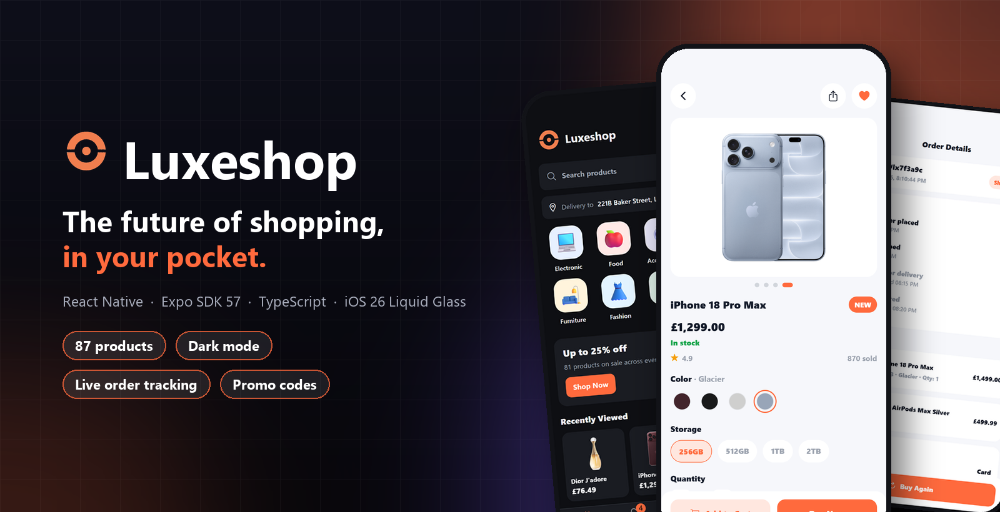

# 🛸 Luxeshop

**A next-gen shopping app for iOS, Android and the web, built with React Native and Expo.**

*Liquid Glass tabs · 87 products across 8 worlds · accounts that sync everywhere · live order tracking · dark mode that actually follows the night*

<br />


<br />


[**🚀 Launch it**](#-launch-sequence) · [**✨ Features**](#-feature-tour) · [**🧠 Under the hood**](#-under-the-hood) · [**🚧 Roadmap**](#-roadmap)

</div>

---

## 👋 Welcome aboard

Luxeshop is a full shopping experience, not a static UI mock-up. You can browse 8 categories, pick the exact colour and storage of a brand-new iPhone 18 Pro, apply a promo code, and watch your order move from **Placed → Shipped → Out for delivery → Delivered** in real time.

**Create an account and your world follows you.** Your cart, wishlist, orders, delivery address and reviews sync to the cloud with **Supabase**, so you can start shopping on your phone and check out on another device. Prefer to stay anonymous? Browse as a guest and everything is remembered on your device; it moves into your account the moment you sign up.

> 💡 **Recruiters:** jump to [Under the hood](#-under-the-hood) for the architecture, or to [Engineering highlights](#-engineering-highlights) for the problems this project solved.

---


## 📸 Take a look

<div align="center">

| Home | Pick your colour | Live tracking | Checkout |
|:---:|:---:|:---:|:---:|
| 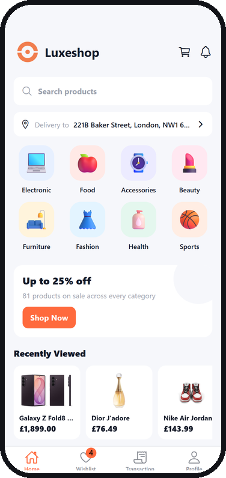 | 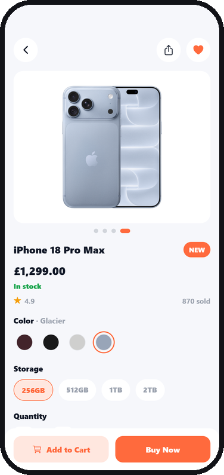 | 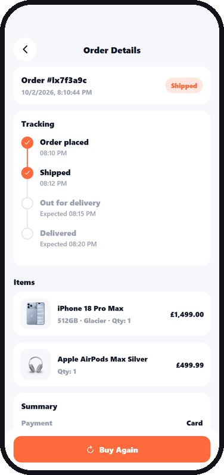 | 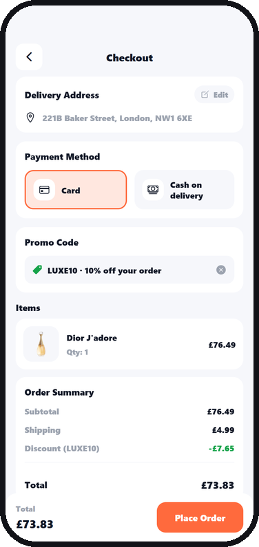 |

| 🌙 Home after dark | 🌙 Galaxy S26 Ultra | 🌙 Sports aisle | 🌙 Your profile |
|:---:|:---:|:---:|:---:|
| 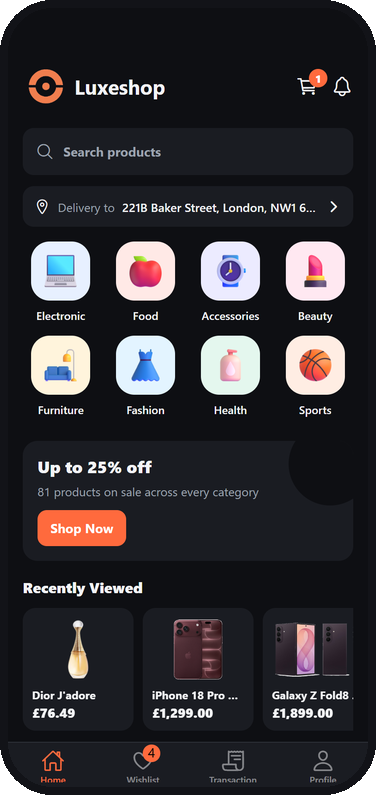 | 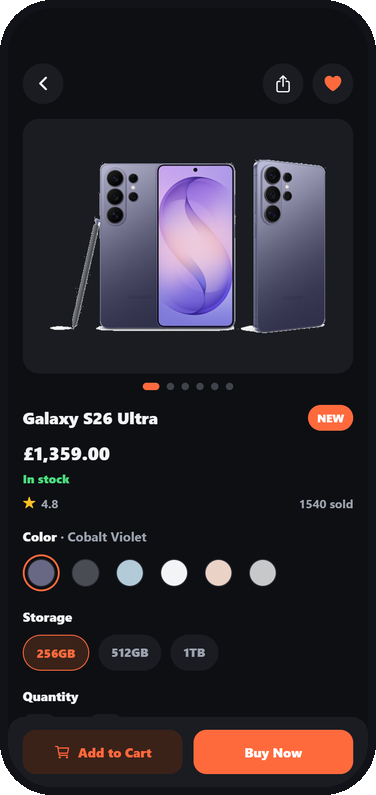 | 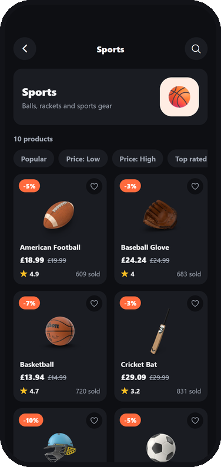 | 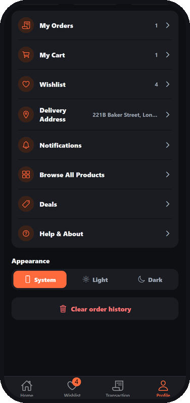 |

| Smart search | Category pages | Flash sale | Wishlist |
|:---:|:---:|:---:|:---:|
| 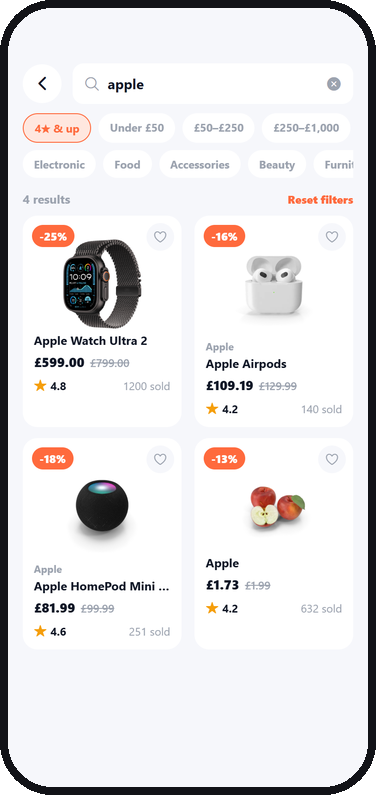 | 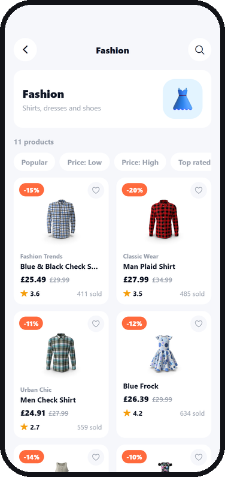 | 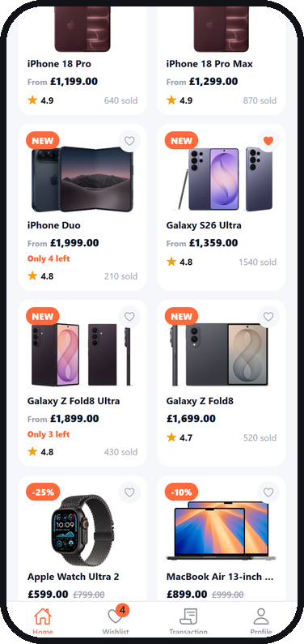 | 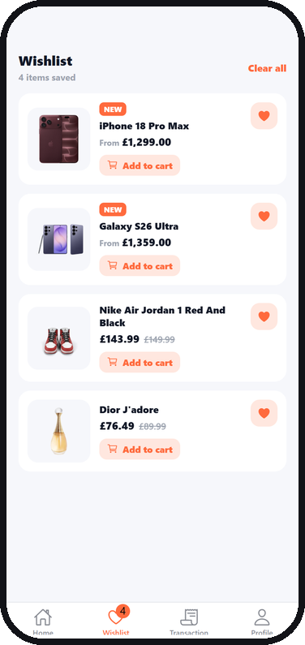 |

| 🔐 Log in | 🔐 Create an account | 🔐 Guest or member |
|:---:|:---:|:---:|
| 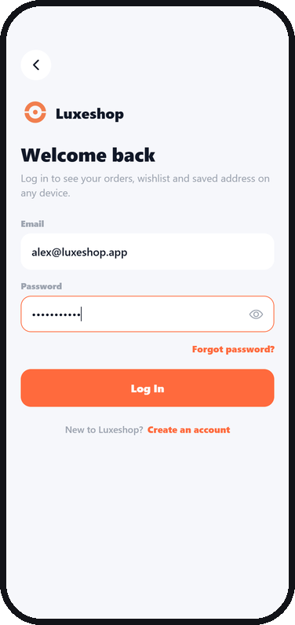 | 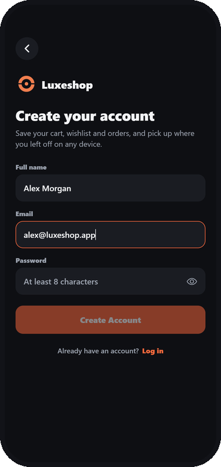 | 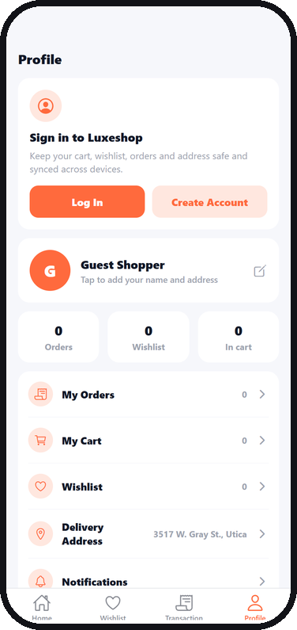 |

</div>

---

## ✨ Feature tour

### 🛍️ Shop the future
- **This season's flagships at real UK prices:** iPhone 18 Pro, 18 Pro Max, Apple's first foldable **iPhone Duo**, Galaxy S26 Ultra, Galaxy Z Fold8 and Z Fold8 Ultra.
- **Every colour has its own photo.** Tap a swatch or swipe the gallery and the two stay in sync. That's 24 official product shots across the phones.
- **Pricing follows your storage choice:** pick 1TB and the price updates instantly.
- **8 category worlds** (Electronic, Food, Accessories, Beauty, Furniture, Fashion, Health, Sports) with **87 products**, sorting, and modern 3D category icons.
- **Real deals:** crossed-out original prices, a banner calculated from what's actually on sale, and a Flash Sale countdown that really ticks down to midnight.
- **Stock awareness:** "Only 3 left" warnings, sold-out states, and quantities you can't push past what's in stock.

### 🧭 Find anything
- **Search across names, brands and categories,** with suggestions as you type.
- **Filters:** price range, category, and "4★ & up".
- **Recent searches** and a **Recently viewed** row on the home screen.

### 🔐 Your account, everywhere
- **Sign up, log in and reset your password** by email, with friendly error messages instead of cryptic codes.
- **Cloud sync:** your cart, wishlist, orders, address and reviews are saved to your account and follow you to any device.
- **Guest-friendly:** browse and fill your cart without an account. Sign in at checkout and everything you did as a guest comes with you.
- **Stays signed in** between launches, and signing out clears your data from the device.
- **Shared reviews:** everyone sees everyone's reviews, and only real buyers can post one.

### 💳 Checkout that feels real
- **A persistent cart** that keeps colour and storage variants as separate lines.
- **Promo codes:** try `LUXE10`, `WELCOME20` or `FREESHIP` 🤫
- **Card or cash on delivery,** saved with your order.
- **Delivery address with "📍 Use my current location":** GPS plus reverse geocoding fills in your street for you.

### 📦 After you buy
- **A live tracking timeline** with expected times for every stage.
- **Cancel** before your order ships, or **Buy Again** in one tap.
- **Write a review** (stars plus comment) for anything you've ordered.
- **Notifications** for your orders and the latest drops.

### 🎨 Feels premium
- **iOS 26 Liquid Glass:** a native glass tab bar that shrinks as you scroll, plus floating glass buttons on product pages.
- **Material 3 on Android,** a clean tab bar on web: one codebase, native on each.
- **Dark mode:** follows your system, or choose Light or Dark yourself in Profile → Appearance.
- **Haptic feedback** on hearts, swatches, add to cart and checkout.
- **Smooth images** via `expo-image`, skeleton loaders, and pull-to-refresh on orders.

---

## 🚀 Launch sequence

> **You'll need:** [Node.js 20+](https://nodejs.org) and, to run it on your phone, the free **Expo Go** app ([iOS](https://apps.apple.com/app/expo-go/id982107779) · [Android](https://play.google.com/store/apps/details?id=host.exp.exponent)).

```bash
# 1. Clone the ship
git clone https://github.com/BrightEluno/Luxeshop.git
cd Luxeshop

# 2. Fuel up
npm install

# 3. Lift off 🚀
npx expo start
```

Then choose your destination:

| Destination | How |
|---|---|
| 📱 **Your phone** | Scan the QR code with your camera (iOS) or the Expo Go app (Android) |
| 🍏 **iOS Simulator** | Press `i` in the terminal (macOS with Xcode) |
| 🤖 **Android Emulator** | Press `a` in the terminal (Android Studio) |
| 🌐 **Web browser** | Press `w`, or run `npm run web` |

> ✨ **To see Liquid Glass,** open the app on an iPhone running **iOS 26 or later**. Other devices get a polished fallback automatically.

### ☁️ Optional: connect your own backend

Out of the box the app runs in **guest mode**: everything works and is stored on the device. To switch on accounts and cloud sync, plug in your own free [Supabase](https://supabase.com) project:

1. **Create a project** at [supabase.com](https://supabase.com) (the free tier is plenty).
2. **Add your keys:** copy `.env.example` to `.env.local`, then fill in the **Project URL** and **publishable key** from *Project Settings → API*.
3. **Build the database:** in *SQL Editor*, run [`supabase/schema.sql`](supabase/schema.sql). It creates the tables and the security rules in one go.
4. **Allow the app's links:** in *Authentication → URL Configuration → Redirect URLs*, add `luxeshop://**`, `exp://**` and `http://localhost:8081/**` so password-reset emails can open the app.
5. **Restart with a fresh cache:** `npx expo start --clear` (Expo caches environment values, so `--clear` makes it pick up your new keys). The Profile tab now shows **Log In** and **Create Account**. 🎉

> 💌 Supabase's built-in email service only delivers to your own team's addresses. For public sign-ups, either turn off *Confirm email* (*Authentication → Sign In / Providers → Email*) or connect a free email provider such as [Resend](https://resend.com).

---

## 🧠 Under the hood

### Tech stack

| Layer | Tech |
|---|---|
| Framework | **Expo SDK 57**, React Native 0.86 (New Architecture), React 19.2 with the React Compiler |
| Language | **TypeScript 6**, strict mode |
| Navigation | **Expo Router**: file-based routes, typed links, native stack, native tabs |
| UI | `expo-glass-effect` (Liquid Glass), `expo-image`, `@expo/vector-icons`, Reanimated 4 |
| Device | `expo-location` (GPS + reverse geocoding), `expo-haptics`, the native share sheet |
| Backend | **Supabase**: Postgres, email auth, Row Level Security |
| State | React Context + hooks, one provider per domain, synced to the cloud when signed in |
| Storage | `@react-native-async-storage/async-storage` for guests, offline use and the saved session |

### How it fits together

<picture>
  <source media="(prefers-color-scheme: dark)" srcset="docs/architecture-dark.png" />
  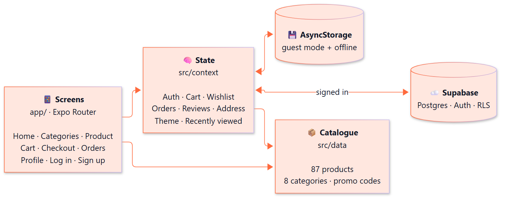
</picture>

<sub>Diagram source: <a href="docs/architecture.mmd"><code>docs/architecture.mmd</code></a></sub>

### Project map

```
Luxeshop/
├── app/                     # 🧭 Every file is a screen (Expo Router)
│   ├── (tabs)/              #    Home, Wishlist, Transaction, Profile + tab bar
│   ├── product/[id].tsx     #    Colours, storage, gallery, stock, share
│   ├── category/[slug].tsx  #    8 categories + Deals / Flash Sale / All
│   ├── order/[id].tsx       #    Live tracking timeline, cancel, buy again
│   ├── reviews/[id].tsx     #    Read and write reviews
│   ├── login · signup · forgot-password · reset-password
│   └── cart · checkout · search · address · notifications · help …
├── components/              # 🧩 ProductCard, Price, GlassIconButton, Skeleton, AuthLayout
├── hooks/                   # ⏱️ useNow, useCountdownToMidnight, useColorScheme
├── supabase/schema.sql      # 🗄️ Tables + Row Level Security, run once in Supabase
└── src/
    ├── context/             # 🧠 Auth, Cart, Orders, Wishlist, Reviews, Address, Theme…
    ├── lib/supabase.ts      # ☁️ Supabase client (guest mode when no keys)
    ├── data/                # 📦 Product catalogue, categories, promo codes
    ├── constants/colors.ts  # 🎨 Light + dark palettes
    ├── utils/               # 🔧 Price formatting, haptics
    └── assets/images/       # 🖼️ Product photos, category icons
```

---

## 🏆 Engineering highlights

These are the parts I'm proudest of, the problems that needed more than a quick fix:

- **🎨 A theme system built for dark mode.** Every screen builds its styles from a palette with names that describe each colour's purpose (`surface`, `onPrimary`, `primarySoft`…), through one `useThemedStyles` hook. The same palette drives React Navigation's containers, so nothing flashes white in the dark.
- **🔄 Persistence without race conditions.** Each context loads saved data and **merges** it with anything that changed during start-up. Opening the app straight onto a product never wipes out your history.
- **🖼️ Images that survive app updates.** Bundled image references change between builds, so saved carts and orders store only product IDs and colour names, and look the right photo up again when loaded.
- **🎠 A carousel that can't get out of sync.** Tapping a swatch locks the carousel while it animates, with a timeout so the lock always releases. Coming back to the screen snaps it to the selected colour, even if you left halfway through a scroll.
- **📦 Stock shared across variants.** A 1TB and a 2TB iPhone draw from the same stock, and quantity limits apply everywhere: product page, cart, wishlist and Buy Again.
- **⏱️ Order stages derived from time.** There's no fake background job. An order's stage is calculated from when it was placed, so it's always correct, even after the app has been closed for hours.
- **🛡️ Security enforced by the database, not just the app.** Row Level Security means each user can only read and write their own cart, orders and address. A column-level grant lets you cancel an order but never edit its total, and a policy checks your order history before accepting a review, so only real buyers can review.
- **🔀 Guest-to-account handover.** Sign in and your guest cart, wishlist and orders are merged into your account (quantities reconciled, duplicates skipped), then every change is synced, with cart writes debounced into a single request. Signing out wipes the device copy.
- **📴 Works without the backend.** No keys? The app runs fully in guest mode. Server unreachable? Local data stays as the fallback and the app keeps working.

---

## 🎮 Easter eggs

| Code | What it does |
|---|---|
| `LUXE10` | 10% off your whole order |
| `WELCOME20` | £20 off orders over £100 |
| `FREESHIP` | Free delivery |

Also try: placing an order, then waiting **2 minutes** 👀

---

## 🚧 Roadmap

- [x] Expo SDK 57 + New Architecture
- [x] Liquid Glass navigation
- [x] 8 categories, 87 products, colour and storage variants
- [x] Cart, checkout, promo codes, payment method
- [x] Live order tracking, cancel, buy again
- [x] Reviews, search filters, recently viewed
- [x] Dark mode, haptics, location-based address
- [x] 🔐 Email accounts: sign up, log in, password reset
- [x] ☁️ Cloud backend (Supabase) so your account syncs across devices
- [ ] 🍏 Sign in with Apple and Google
- [ ] 💌 Custom email provider for sign-up confirmations
- [ ] 💳 Real payments with Stripe, Apple Pay and Google Pay
- [ ] 🔔 Push notifications for order updates

---

## 🙏 Credits

- **Phone photos** © Apple and Samsung, used here for demonstration only.
- **Catalogue products and photos** from [DummyJSON](https://dummyjson.com), a free product dataset for demo apps.
- **Category icons:** [Microsoft Fluent Emoji](https://github.com/microsoft/fluentui-emoji) (MIT licence).
- Built with [Expo](https://expo.dev) 💙 and [Supabase](https://supabase.com) 💚

> Luxeshop is a portfolio project. No real payments are taken and no orders are shipped (sadly 📦).

---

<div align="center">

### 👨‍🚀 Built by [@BrightEluno](https://github.com/BrightEluno)

**If Luxeshop made you smile, give it a ⭐. It genuinely helps!**

*Open to opportunities in mobile and front-end development. Let's build something futuristic together.*

</div>
